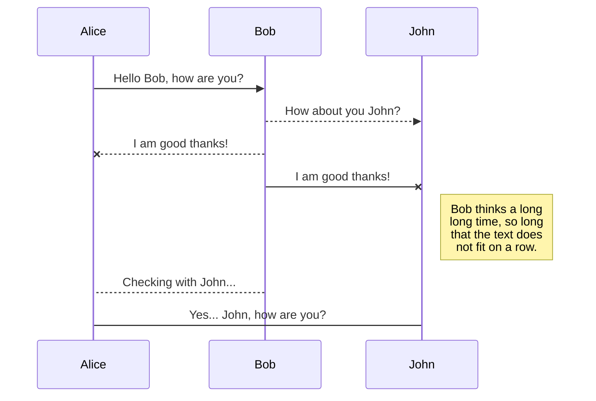
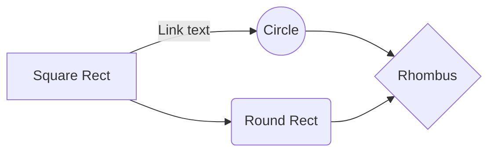

# AGV MONITOR web app ติดตาม รถ AGV เพื่อดูสถานะและสรุปความผิดปกติ ด้วยระบบ IOT 


เป็นโปรแกรมที่ถูกสร้างมาเพื่อดึงข้อมูล จาก PLC ของตัวรถ AGV โดย ใช้ โปรโตคอลกลาง ชื่อ ว่า Modbus ใน Node-red ที่อยู่ในเครื่อง Rasberry-pi ดึงข้อมูลมาเก็บไว้ใน database ที่ชื่อ Postgresql และมีข้อมูล Buffer ด้วย InfluxDB แสดงผล โดย ใช้ api จาก Node-red ส่งค่าไปยัง Web app เพื่อแสดงผล 


## สารบัญ Table of Contents

 - [ขั้นตอนการติดตั้ง](#%E0%B8%82%E0%B8%B1%E0%B9%89%E0%B8%99%E0%B8%95%E0%B8%AD%E0%B8%99%E0%B8%81%E0%B8%B2%E0%B8%A3%E0%B8%95%E0%B8%B4%E0%B8%94%E0%B8%95%E0%B8%B1%E0%B9%89%E0%B8%87)
 - [วิธีใช้งาน](#%E0%B8%A7%E0%B8%B4%E0%B8%98%E0%B8%B5%E0%B9%83%E0%B8%8A%E0%B9%89%E0%B8%87%E0%B8%B2%E0%B8%99)


## ขั้นตอนการติดตั้ง
การติดตั้ง **Node-RED** บน **Raspberry Pi**
1. อัพเดตระบบ:  
   ```bash
   sudo apt update && sudo apt upgrade -y
   ```
2. ติดตั้ง Node.js และ Node-RED:  
   ```bash
   bash <(curl -sL https://raw.githubusercontent.com/node-red/linux-installers/master/deb/update-nodejs-and-nodered)
   ```
3. ตั้งค่าให้ Node-RED ทำงานอัตโนมัติ:
   ```bash
   sudo systemctl enable nodered.service
   ```
4. เปิดใช้งาน Node-RED:
   ```bash
   sudo systemctl start nodered
   ```
5. เข้าถึง Node-RED ผ่านเว็บ:  
   ```
   http://<IP Raspberry Pi>:1880
   ```
### **เพิ่ม Nodes เสริมที่ใช้งาน**
ติดตั้ง **node-red-contrib-modbus** (สำหรับเชื่อมต่อกับ PLC):
```bash
cd ~/.node-red
npm install node-red-contrib-modbus
```
ติดตั้ง **node-red-contrib-influxdb** (สำหรับเชื่อมต่อ InfluxDB):
```bash
npm install node-red-contrib-influxdb
```
ติดตั้ง **node-red-contrib-postgresql** (สำหรับเชื่อมต่อ PostgreSQL):
```bash
npm install node-red-contrib-postgresql
```
จากนั้น **รีสตาร์ท Node-RED**:
```bash
sudo systemctl restart nodered
```
---
### **ติดตั้ง Node-RED บน Windows Server**

การติดตั้ง **Node-RED** บน **Windows Server** ตามขั้นตอนนี้:

----------

## **1. ติดตั้ง Node.js**

Node-RED ต้องใช้ **Node.js** และ **npm** ในการทำงาน:

1.  ไปที่เว็บไซต์ [Node.js Download](https://nodejs.org/en/download/)
2.  ดาวน์โหลด **LTS version (Long Term Support)**
3.  ติดตั้ง Node.js โดยเลือก **"Add to PATH"** ระหว่างการติดตั้ง
4.  ตรวจสอบว่า Node.js และ npm ติดตั้งเรียบร้อยแล้วโดยใช้ Command Prompt (CMD) หรือ PowerShell:
    
    ```powershell
    node -v
    npm -v
    
    ```
    
    ถ้าแสดงเวอร์ชันออกมา แปลว่าติดตั้งสำเร็จ

----------

## **2. ติดตั้ง Node-RED**

เปิด **Command Prompt (CMD)** หรือ **PowerShell** และรันคำสั่ง:

```powershell
npm install -g --unsafe-perm node-red

```

> `-g` = ติดตั้งเป็น global package  
> `--unsafe-perm` = ให้สิทธิ์เต็มสำหรับการติดตั้ง

รอจนกว่าการติดตั้งจะเสร็จ

----------

## **3. เริ่มต้นใช้งาน Node-RED**

หลังจากติดตั้งเสร็จแล้ว ให้พิมพ์:

```powershell
node-red

```

ถ้าทำงานสำเร็จ จะเห็นข้อความว่า:

```
Welcome to Node-RED
...
Server now running at http://127.0.0.1:1880/

```

สามารถเข้าใช้งานผ่านเบราว์เซอร์ที่:

```
http://localhost:1880

```

ถ้าเป็นเครื่องอื่นในเครือข่าย ให้ใช้ **IP ของเซิร์ฟเวอร์**

```
http://<IP ของ Windows Server>:1880

```

----------

## **4. ตั้งค่าให้ Node-RED ทำงานอัตโนมัติเมื่อบูต Windows**

Windows ไม่มี `systemctl` เหมือน Linux แต่สามารถใช้ **Task Scheduler** หรือ **pm2** แทนได้

### **วิธีที่ 1: ใช้ PM2 ให้ Node-RED ทำงานอัตโนมัติ**

1.  ติดตั้ง **PM2**:
    
    ```powershell
    npm install -g pm2
    
    ```
    
2.  รัน Node-RED ผ่าน PM2:
    
    ```powershell
    pm2 start node-red --name "node-red"
    
    ```
    
3.  ตั้งค่าให้ Node-RED ทำงานอัตโนมัติเมื่อ Windows บูต:
    
    ```powershell
    pm2 save
    pm2 startup
    
    ```
    
4.  ตรวจสอบสถานะ:
    
    ```powershell
    pm2 list
    
    ```
    
5.  หยุด Node-RED:
    
    ```powershell
    pm2 stop node-red
    
    ```
    
6.  รีสตาร์ท Node-RED:
    
    ```powershell
    pm2 restart node-red
    
    ```
    

----------

## **5. ติดตั้ง Node-RED เสริม**

หากต้องการติดตั้ง Node-RED เสริมสำหรับการเชื่อมต่อกับ PLC, InfluxDB หรือ PostgreSQL:

```powershell
cd %USERPROFILE%\.node-red
npm install node-red-contrib-modbus
npm install node-red-contrib-influxdb
npm install node-red-contrib-postgresql

```

จากนั้น **รีสตาร์ท Node-RED**:

```powershell
pm2 restart node-red

```

----------

## **6. การเปิดพอร์ต 1880 บน Windows Firewall**

ถ้าเซิร์ฟเวอร์มี **Firewall** เปิดใช้งาน ต้องอนุญาตให้พอร์ต **1880** สามารถเข้าถึงได้:

```powershell
netsh advfirewall firewall add rule name="Node-RED" dir=in action=allow protocol=TCP localport=1880

```


----------


## วิธีใช้งาน

All your files and folders are presented as a tree in the file explorer. You can switch from one to another by clicking a file in the tree.

## Rename a file

You can rename the current file by clicking the file name in the navigation bar or by clicking the **Rename** button in the file explorer.

## Delete a file

You can delete the current file by clicking the **Remove** button in the file explorer. The file will be moved into the **Trash** folder and automatically deleted after 7 days of inactivity.

## Export a file

You can export the current file by clicking **Export to disk** in the menu. You can choose to export the file as plain Markdown, as HTML using a Handlebars template or as a PDF.


# Synchronization

Synchronization is one of the biggest features of StackEdit. It enables you to synchronize any file in your workspace with other files stored in your **Google Drive**, your **Dropbox** and your **GitHub** accounts. This allows you to keep writing on other devices, collaborate with people you share the file with, integrate easily into your workflow... The synchronization mechanism takes place every minute in the background, downloading, merging, and uploading file modifications.

There are two types of synchronization and they can complement each other:

- The workspace synchronization will sync all your files, folders and settings automatically. This will allow you to fetch your workspace on any other device.
	> To start syncing your workspace, just sign in with Google in the menu.

- The file synchronization will keep one file of the workspace synced with one or multiple files in **Google Drive**, **Dropbox** or **GitHub**.
	> Before starting to sync files, you must link an account in the **Synchronize** sub-menu.

## Open a file

You can open a file from **Google Drive**, **Dropbox** or **GitHub** by opening the **Synchronize** sub-menu and clicking **Open from**. Once opened in the workspace, any modification in the file will be automatically synced.

## Save a file

You can save any file of the workspace to **Google Drive**, **Dropbox** or **GitHub** by opening the **Synchronize** sub-menu and clicking **Save on**. Even if a file in the workspace is already synced, you can save it to another location. StackEdit can sync one file with multiple locations and accounts.

## Synchronize a file

Once your file is linked to a synchronized location, StackEdit will periodically synchronize it by downloading/uploading any modification. A merge will be performed if necessary and conflicts will be resolved.

If you just have modified your file and you want to force syncing, click the **Synchronize now** button in the navigation bar.

> **Note:** The **Synchronize now** button is disabled if you have no file to synchronize.

## Manage file synchronization

Since one file can be synced with multiple locations, you can list and manage synchronized locations by clicking **File synchronization** in the **Synchronize** sub-menu. This allows you to list and remove synchronized locations that are linked to your file.


# Publication

Publishing in StackEdit makes it simple for you to publish online your files. Once you're happy with a file, you can publish it to different hosting platforms like **Blogger**, **Dropbox**, **Gist**, **GitHub**, **Google Drive**, **WordPress** and **Zendesk**. With [Handlebars templates](http://handlebarsjs.com/), you have full control over what you export.

> Before starting to publish, you must link an account in the **Publish** sub-menu.

## Publish a File

You can publish your file by opening the **Publish** sub-menu and by clicking **Publish to**. For some locations, you can choose between the following formats:

- Markdown: publish the Markdown text on a website that can interpret it (**GitHub** for instance),
- HTML: publish the file converted to HTML via a Handlebars template (on a blog for example).

## Update a publication

After publishing, StackEdit keeps your file linked to that publication which makes it easy for you to re-publish it. Once you have modified your file and you want to update your publication, click on the **Publish now** button in the navigation bar.

> **Note:** The **Publish now** button is disabled if your file has not been published yet.

## Manage file publication

Since one file can be published to multiple locations, you can list and manage publish locations by clicking **File publication** in the **Publish** sub-menu. This allows you to list and remove publication locations that are linked to your file.


# Markdown extensions

StackEdit extends the standard Markdown syntax by adding extra **Markdown extensions**, providing you with some nice features.

> **ProTip:** You can disable any **Markdown extension** in the **File properties** dialog.


## SmartyPants

SmartyPants converts ASCII punctuation characters into "smart" typographic punctuation HTML entities. For example:

|                |ASCII                          |HTML                         |
|----------------|-------------------------------|-----------------------------|
|Single backticks|`'Isn't this fun?'`            |'Isn't this fun?'            |
|Quotes          |`"Isn't this fun?"`            |"Isn't this fun?"            |
|Dashes          |`-- is en-dash, --- is em-dash`|-- is en-dash, --- is em-dash|


## KaTeX

You can render LaTeX mathematical expressions using [KaTeX](https://khan.github.io/KaTeX/):

The *Gamma function* satisfying $\Gamma(n) = (n-1)!\quad\forall n\in\mathbb N$ is via the Euler integral

$$
\Gamma(z) = \int_0^\infty t^{z-1}e^{-t}dt\,.
$$

> You can find more information about **LaTeX** mathematical expressions [here](http://meta.math.stackexchange.com/questions/5020/mathjax-basic-tutorial-and-quick-reference).


## UML diagrams

You can render UML diagrams using [Mermaid](https://mermaidjs.github.io/). For example, this will produce a sequence diagram:



And this will produce a flow chart:


